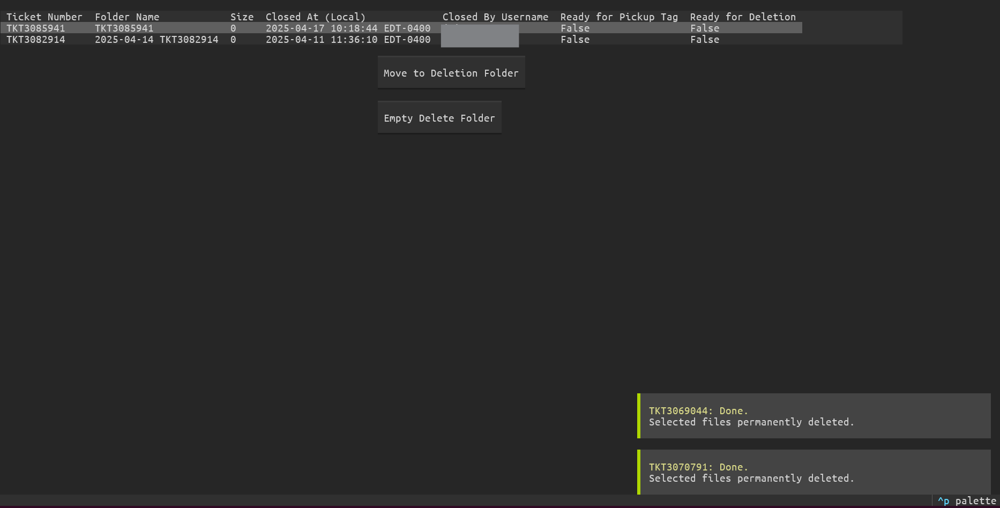

## Campus Local Backups Remover
### Connects ServiceNow with local data backups for easy archival and removal of locally backed up data

#### Configuration
Location of of backups, items to be deleted, and service now instance are controlled by "config.json"

Example layout:
```json
{
    "instance": "example.service-now.com",
    "backups_location": "C:\\backups",
    "deletion_location": "C:\\backups\\_MARKED-FOR-DELETION",
    "get_size": "False" // Gets size of each backup folder if True. Can GREATLY impact loading time if set to true
}
```

Currently, "config.json" is read from the same directory as the binary.

A command line argument may be added later to specify config location.

You should structure the program as follows:

```
   PROGRAM FOLDER:
   |
   ├─backup_manager-bin
   ├─styles.tcss (can be copied from the repo)
   └─config.json
```

#### Logging
Log files are stored in same directory as executable.
Errors are written to "error.log"
Debugging logs are written to "debug.log"
Currently debugging is enabled by default with no flags to disable.
Any folders deleted are placed in an INFO log called "deleted_backups_YYYY_MM_DD.log"

### Screenshots

Login


Main screen
